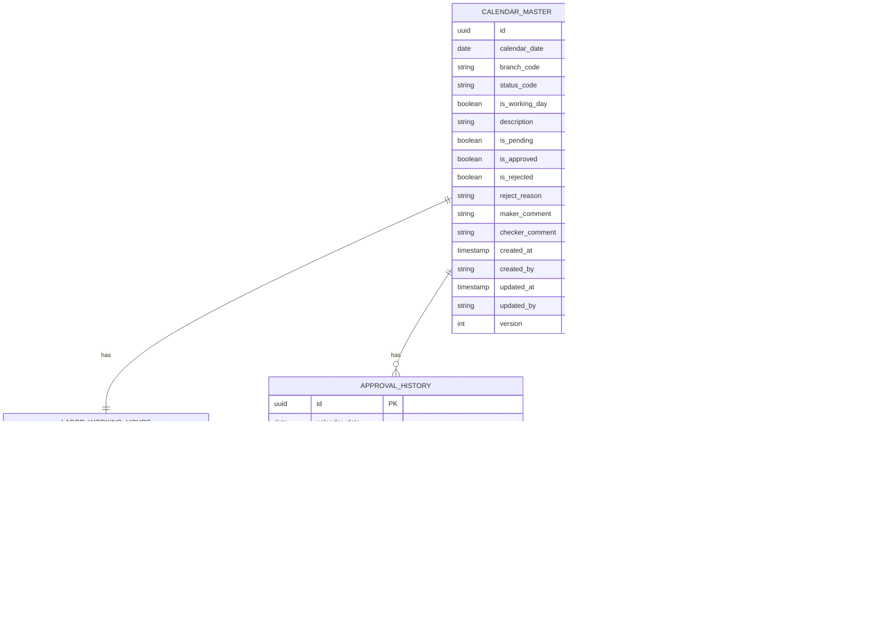

# Calendar Approval System - Database Schema

```mermaid
erDiagram
    CALENDAR_MASTER {
        uuid id PK
        date calendar_date
        string branch_code FK
        string status_code FK
        boolean is_working_day
        string description
        boolean is_pending
        boolean is_approved
        boolean is_rejected
        string reject_reason
        string maker_comment
        string checker_comment
        timestamp created_at
        string created_by
        timestamp updated_at
        string updated_by
        int version
    }

    LABOR_WORKING_HOURS {
        uuid id PK
        uuid calendar_id FK
        decimal working_hours "DEFAULT 8.0"
        string working_hours_uom "DEFAULT 'HOURS'"
        boolean is_active
        timestamp created_at
        string created_by
        timestamp updated_at
        string updated_by
    }

    APPROVAL_HISTORY {
        uuid id PK
        date calendar_date
        string branch_code FK
        string action "PENDING|APPROVED|REJECTED"
        string old_status
        string new_status
        decimal old_working_hours
        decimal new_working_hours
        string maker_comment
        string checker_comment
        string reject_reason
        timestamp action_date
        string action_by
    }

    BRANCH {
        string code PK
        string name
        string timezone
        boolean is_active
        timestamp created_at
        string created_by
        timestamp updated_at
        string updated_by
    }

    STATUS_MASTER {
        string code PK
        string name
        string description
        boolean is_working_day
        boolean is_active
        timestamp created_at
        string created_by
        timestamp updated_at
        string updated_by
    }

    CALENDAR_MASTER ||--|| LABOR_WORKING_HOURS : "has"
    CALENDAR_MASTER ||--o{ APPROVAL_HISTORY : "has"
    CALENDAR_MASTER ||--|| BRANCH : "belongs_to"
    CALENDAR_MASTER ||--|| STATUS_MASTER : "has"
```